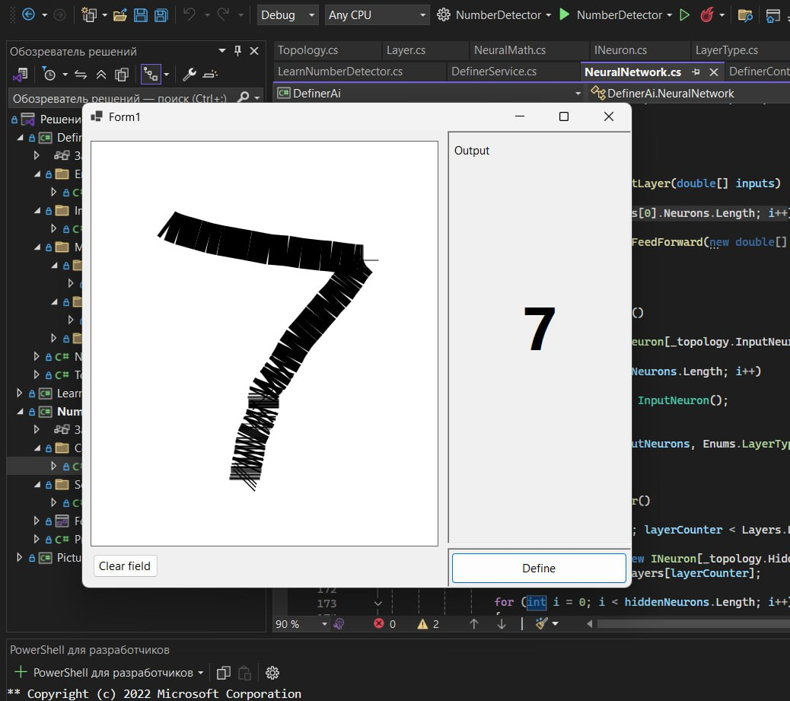

# Handwritten Digit Recognition (C# + WinForms)

This is a desktop application built with **C# and Windows Forms**, featuring a **custom neural network** that recognizes digits drawn by the user. The neural network is implemented and trained **entirely from scratch**, with no external machine learning frameworks.

---

## Features

- Draw digits (0–9) directly in the app using your mouse.
- A simple GUI built with WinForms.
- Real-time prediction using a custom feedforward neural network.
- Native training and inference logic written entirely in C#.

---

## Neural Network Details

- Architecture: Multi-layer perceptron (MLP)
- Activation function: Sigmoid / ReLU (depending on implementation)
- Input: 28x28 grayscale bitmap (similar to MNIST)
- Training: Performed locally using a handcrafted dataset
- No use of external ML libraries like TensorFlow, ML.NET, or Accord.NET

---

## Screenshots

| Drawing Interface | Prediction View | Output Example |
|------------------|------------------|----------------|
|  |  |  |

---

## How to Run

1. Clone the repository:
   ```bash
   git clone https://github.com/your-username/your-repo.git
```

2.Open the .sln file in Visual Studio 2022 or later.

3. Build and run the project:

- Press Ctrl + F5 to start without debugging.

## Requirements
- Windows OS
- .NET Framework 4.7.2 or later
- Visual Studio 2022